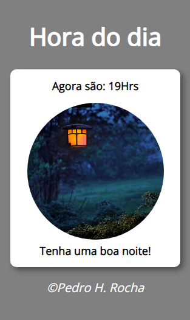

## <h1><em>Olá pessoas!</em>😁</h1> 

<h3>Projeto desenvolvido juntamente com o professor Gustavo Guanabara, onde consiste em mostrar as Horas (tempo real), juntamente com uma imagem que retrata o período e uma mensagem do período.
Modifiquei os estilos, apliquei responsividade para vários tamanhos de tela.</h3>

#

#

<a href ="">⚡️Deploy🔥</a>

#

<h4>That´s all folks!🤘👋 Espero que gostem e aguardem os novos capítulos!!😎😉</h4>

#

<h5> Minhas redes sociais:</h5>  
    
 
        
         
    

